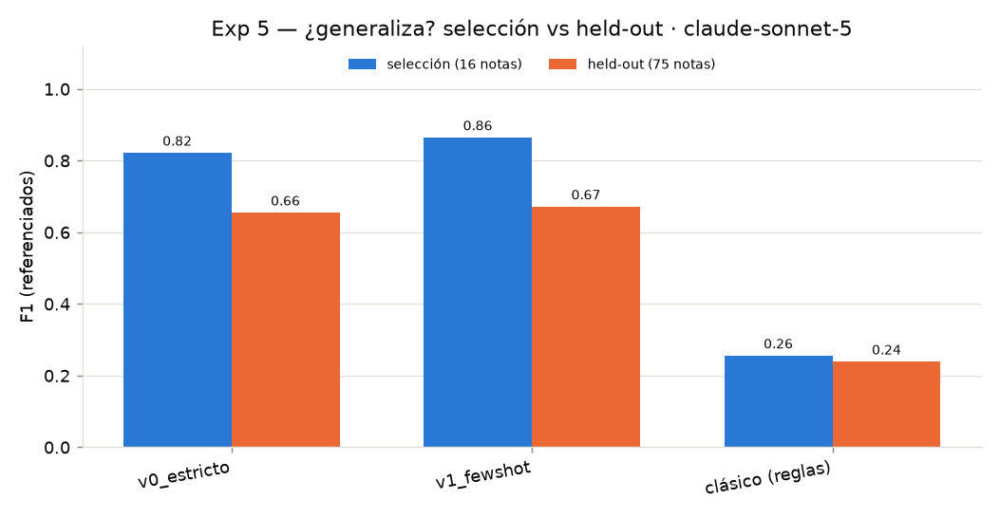

# trust-sources — detección de fuentes periodísticas con LLMs

Proyecto del seminario, sobre **[trust-monitor](https://github.com/timmd-9216/trust)**.
Objetivo: **detectar las fuentes de una noticia** (a quién se le atribuye cada
información) y superar al detector clásico basado en reglas, usando modelos de
lenguaje (LLMs). Es una investigación: comparamos enfoques, probamos prompts,
medimos contra anotaciones humanas y **documentamos aciertos y fallas** en la
**[GitHub Page](https://mateoboerr.github.io/seminario_lunes/)**.

> El proyecto **trust-monitor** (repo del profe) se usa **solo como fuente de
> datos**: se clona aparte en `trust-monitor/` (gitignoreado), no se toca ni se sube.

## Resultado actual

| Detector | Precisión | Recall | F1 |
|---|---|---|---|
| Clásico (reglas) | 0.26 | 0.25 | **0.26** |
| LLM `gemini-2.5-flash-lite` (mejor prompt: auto-verificación) | 0.78 | 0.70 | **0.74** |
| LLM `claude-sonnet-5` (mejor prompt, 16 notas de selección) | 0.94 | 0.80 | **0.86** |
| Acuerdo entre anotadores | — | — | **0.71** |
| **LLM `claude-sonnet-5` · held-out (75 notas no vistas)** | 0.71 | 0.64 | **0.67** |

**El modelo importa más que el prompt… salvo que se acierte el prompt:** con la
misma variante, cambiar de modelo vale +0.26–0.30 de F1; pero la variante que le
sirve al modelo chico (pedirle que cite evidencia o descarte) achica la brecha a
**+0.07** — y es, a la vez, la **mejor** variante de Gemini y la **peor** de
Sonnet. Un ranking de prompts no se hereda entre modelos. **Y la validación held-out cambia
la conclusión principal:** el 0.86 medido sobre las 16 notas con las que se
eligieron los prompts no generaliza — sobre 75 notas nunca vistas da **0.67**
(~0.70 contra el mismo anotador). Aun así el LLM casi triplica al clásico
(0.24) en el held-out. En salida rica (spans), v1 con Sonnet da **0.54** vs
**0.39** del clásico; y el pipeline multi-LLM de dos pasadas **pierde** contra la
pasada única (0.69 vs 0.73), con la variante barato+caro (Haiku→Sonnet) peor
todavía en spans (0.36) — y el daño concentrado justo en el componente que
produce la primera etapa. Detalle, fallas incluidas, en la
[bitácora](docs/experimentos.md).



## Estructura

```
trust_sources/            # paquete (código reusable)
  schema.py               # Source / Span — estructura de salida (estilo Trust)
  io_anotaciones.py       # carga de anotaciones humanas (Label Studio)
  matching.py             # normalización + emparejamiento difuso + métricas
  evaluation.py           # P/R/F1 + techo humano
  llm_client.py           # cliente multi-proveedor (Gemini/Anthropic)
  detectors/
    base.py               # interfaz SourceDetector (Strategy)
    classic.py            # detector clásico por reglas
    llm.py                # detector LLM (v0 y v1 con spans)
    multi_llm.py          # pipeline de dos LLMs (afirmaciones → fuentes)
experiments/
  run_benchmark.py        # experimento base (v0)
  exp1_prompts.py         # variantes de prompt × modelos (Gemini vs Claude)
  exp2_salida_v1.py       # salida rica v1 + evaluación a nivel de span
  exp3_multi_llm.py       # multi-LLM (2 pasadas) vs single-pass
  exp4_citas_implicitas.py# citas implícitas (Afirmacion Debil, exploratorio)
  viz_matriz.py           # matriz de aciertos/fallas por nota (heatmap)
  cache/                  # caches por (modelo, variante, nota) — reproducible sin key
results/                  # métricas y gráficos generados
docs/                     # contenido de la GitHub Page (experimentos, metodología)
trust-monitor/            # repo de datos (gitignoreado; se clona)
```

## Instalación y uso

```bash
# 1. Datos
git clone https://github.com/timmd-9216/trust.git trust-monitor
# 2. Dependencias
pip install -r requirements.txt
# 3. Correr el benchmark (usa cache; sin API key funciona igual)
python -m experiments.run_benchmark
```

Para correr el LLM **en vivo** (gratis con Google Gemini):
```bash
export GEMINI_API_KEY="<key de https://aistudio.google.com/apikey>"
python -m experiments.run_benchmark
```
El cliente elige proveedor solo: Gemini si hay `GEMINI_API_KEY`, si no Anthropic
(`ANTHROPIC_API_KEY`), si no usa el cache.

**Elegir proveedor explícitamente.** Con ambas keys, `LLM_PROVIDER` fuerza cuál usar
(el free tier de Gemini no alcanza para todas las corridas; Anthropic las completa):
```bash
export ANTHROPIC_API_KEY="..."
export LLM_PROVIDER=anthropic      # gemini | anthropic
python -m experiments.exp1_prompts    # variantes de prompt
python -m experiments.exp2_salida_v1  # salida rica v1 + eval de spans
```

**La API key va en `.env`** (gitignoreado, NUNCA se committea); el paquete lo carga
con `llm_client.load_dotenv()`. Ejemplo de `.env`:
```
GEMINI_API_KEY=...
# o
ANTHROPIC_API_KEY=...
LLM_PROVIDER=anthropic
```

## Demo (CLI) y tests

Correr un detector sobre un texto y ver la salida (forma Trust `get_explicit_sources`):
```bash
python -m trust_sources "El ministro aseguró: “la economía mejora”."   # clásico, sin API
python -m trust_sources --file nota.txt --detector v1                   # LLM v1 (usa la key)
```
Detectores: `clasico` (default, sin API) · `v0` · `v1` · `multi`.

Tests (sin API, con stubs):
```bash
pip install pytest
python -m pytest tests/ -q
```

## Integración con Trust

`TrustSourceAdapter` envuelve cualquier detector y lo expone con la interfaz de Trust
(`get_explicit_sources`), para enchufar el LLM en su pipeline o compararlo contra el
clásico usando el mismo contrato de salida:
```python
from trust_sources import LLMSourceDetectorV1, TrustSourceAdapter
adapter = TrustSourceAdapter(LLMSourceDetectorV1(client))
sources = adapter.get_explicit_sources(texto)   # list[dict] forma Trust
```

## Documentación

- 🔬 **[docs/experimentos.md](docs/experimentos.md) — BITÁCORA de experimentos** (el
  corazón del proyecto: cada prompt/modelo/pipeline probado, qué anduvo y qué no).
- [docs/esquema_salida.md](docs/esquema_salida.md) — el formato de salida (v0 → v1, compatible con Trust)
- [docs/metodologia.md](docs/metodologia.md) — datasets y cómo se evalúa
- [docs/roadmap.md](docs/roadmap.md) — plan, experimentos y **next steps**
- [ESTADO_PROYECTO.md](ESTADO_PROYECTO.md) — handoff completo (todo lo que se hizo y se sabe)
- [PENDIENTES.md](PENDIENTES.md) — checklist de lo que falta (casi todo espera Anthropic)
