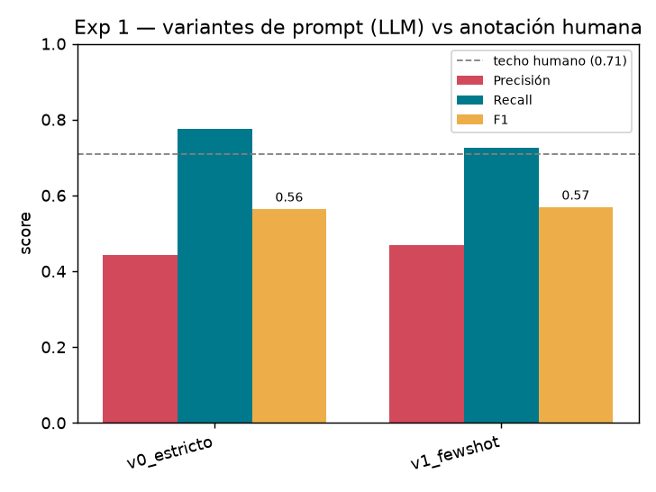

# Bitácora de experimentos

Registro cronológico de cada experimento: **qué probamos, con qué config, qué dio
y qué concluimos**. Es el corazón del entregable — el valor no es solo "que
funcione", sino *haber investigado*. Cada entrada se mide contra la anotación
humana (16 notas doble-anotadas, techo humano **F1 0.71**) y se reproduce con
`python -m experiments.run_benchmark`.

> **Cómo leer las métricas:** P = precisión (de lo que detecté, cuánto era fuente
> real), R = recall (de las fuentes reales, cuántas atrapé), F1 = media armónica.
> Objetivo de Etapa 1: **subir la precisión del LLM (0.44)** sin perder recall.

## Tabla resumen

| # | Fecha | Detector / config | P | R | F1 | Conclusión |
|---|---|---|---|---|---|---|
| 0a | 2026-07-01 | Clásico (reglas: comillas+verbo+propio) | 0.26 | 0.25 | **0.26** | baseline clásico |
| 0b | 2026-07-01 | LLM · prompt estricto v0 · `gemini-2.5-flash-lite` | 0.44 | 0.78 | **0.56** | baseline LLM; recall alto, sobre-detecta |
| 1 · v1 | 2026-07-02 | LLM · few-shot (2 ejemplos) | 0.47 | 0.72 | **0.57** | +0.03 P a costa de −0.06 R; F1 casi igual |
| 1 · v2 | 2026-07-02 | LLM · reglas negativas duras | — | — | — | 🚧 parcial 8/16 (free tier rate-limited) |
| 1 · v3 | 2026-07-02 | LLM · auto-verificación (cita evidencia) | — | — | — | 🚧 parcial 2/16 (free tier rate-limited) |
| 2 | 2026-07-02 | Salida rica v1 (afirmacion+conector+referenciado+tipo, spans) | — | — | — | pipeline listo y validado (stub); medición en vivo pendiente |

---

## Exp 0 — Baselines (v0)

**Fecha:** 2026-07-01 · **Estado:** ✅ hecho

**Hipótesis.** Un LLM con un prompt de instrucciones (sin ejemplos) supera al
detector clásico por reglas en detección de fuentes.

**Setup.**
- Datos: 16 notas del lote doble-anotado (`lch_100_119` ↔ `xig_20_39`).
- Clásico: reglas comillas + verbo de habla + nombre propio.
- LLM: `gemini-2.5-flash-lite`, `PROMPT_V0` (estricto, pide solo entidades con
  atribución explícita, salida `{"fuentes": [...]}`).
- Métrica: P/R/F1 micro a nivel de *conjunto de referenciados por nota*.

**Resultado.**

| Detector | P | R | F1 |
|---|---|---|---|
| Clásico | 0.26 | 0.25 | **0.26** |
| LLM | 0.44 | 0.78 | **0.56** |
| Techo humano | — | — | **0.71** |

**Qué anduvo.** El LLM **duplica** el F1 del clásico y tiene recall alto (0.78):
atrapa instituciones y atribuciones parafraseadas que el clásico (solo comillas)
no ve. Ejemplos concretos en [results/ejemplos.md](../results/ejemplos.md).

**Qué no.** La **precisión es baja (0.44)**: el LLM **sobre-detecta** — marca como
fuente entidades solo mencionadas o protagonistas sin atribución. Ese es el
problema a atacar en los próximos experimentos.

**Próximo paso.** Variar el prompt (few-shot, reglas negativas más fuertes,
pedir justificación) y comparar modelos, midiendo si sube P sin bajar R.

---

## Exp 1 — variantes de prompt (subir la precisión del LLM)

**Fecha:** 2026-07-02 · **Estado:** 🟡 parcial (v0/v1 completos; v2/v3 rate-limited)

**Hipótesis.** El baseline (`v0_estricto`) tiene recall alto (0.78) pero
sobre-detecta (P 0.44). Cambiando el prompt —dándole ejemplos, reglas negativas
más duras, o pidiéndole que justifique cada fuente— deberíamos **subir la
precisión sin hundir el recall**.

**Setup.** Mismo detector `LLMSourceDetector` (prompt inyectado), mismo modelo
`gemini-2.5-flash-lite`, mismas 16 notas. 4 variantes:
`v0_estricto` (baseline), `v1_fewshot` (baseline + 2 ejemplos: uno con fuente
clara, uno con entidades solo mencionadas), `v2_reglas_duras` (criterio de
exclusión reforzado, "ante la duda excluí"), `v3_justifica` (el modelo debe citar
la **evidencia** —verbo o cita— o descartar el candidato). Reproducible:
`python -m experiments.exp1_prompts`.

**Resultado (variantes completas).**

| Variante | P | R | F1 | ΔP | ΔF1 |
|---|---|---|---|---|---|
| `v1_fewshot` | 0.47 | 0.72 | **0.57** | +0.03 | +0.01 |
| `v0_estricto` | 0.44 | 0.78 | **0.56** | — | — |



**Qué anduvo.** El few-shot **sí mueve la precisión en la dirección buscada**
(+0.03): los 2 ejemplos negativos ("Milei/Villarruel mencionados pero sin
atribución") le enseñan a descartar protagonistas. 

**Qué no.** El efecto es **chico** y se paga con recall (−0.06): el F1 queda
prácticamente igual (0.56 → 0.57). Few-shot solo no alcanza para cerrar la brecha
con el techo humano (0.71). Las palancas más agresivas contra la sobre-detección
(`v2_reglas_duras`, `v3_justifica`) son las prometedoras, pero **no se pudieron
medir completas**: el free tier de Gemini (límite ~20 req/min + 503 por demanda)
cortó las corridas. Quedaron en 8/16 y 2/16 y sus métricas todavía no son
comparables (las notas faltantes cuentan como vacío).

**Hallazgo metodológico (una falla que vale documentar).** Reproducir experimentos
LLM con herramientas **gratuitas** tiene un costo oculto: el rate-limit. Cada
llamada fallida gatilla reintentos que **queman la cuota por-minuto**, así que hay
que **pacear** (throttle entre llamadas), **cachear por (variante, artículo)** para
no repetir, y **cortar** ante fallos en cadena (circuit breaker) para no malgastar
cuota. Todo eso ya está en `experiments/exp1_prompts.py`.

**Próximo paso.** Completar `v2`/`v3` en una ventana de cuota fresca (re-correr el
script; el cache retoma donde quedó). Si `v2` sube la precisión de verdad, es la
base para v1 del esquema. Alternativa: correr con un proveedor de pago para no
depender del free tier.

## Exp 2 — salida rica v1 (el OUTPUT que pidió el profe)

**Fecha:** 2026-07-02 · **Estado:** 🟢 pipeline listo y validado · medición en vivo pendiente

**Qué es.** Pasar de la salida v0 (solo el nombre de la fuente) a la **v1**: por
cada fuente, **afirmacion + conector + referenciado**, cada uno **con su posición**
(span start/end), más el **tipo** (persona / institución / documento / anónima) y
si la cita es **explícita o implícita**. La forma del dict es idéntica a
`get_explicit_sources` de Trust → interoperable. Detalle en
[esquema_salida.md](esquema_salida.md).

**Cómo.** Nuevo `LLMSourceDetectorV1` (misma interfaz `SourceDetector`, cliente
inyectado): el LLM devuelve las partes copiando el **texto exacto** de la nota, y
los **spans se calculan con código** (`schema.source_from_components` →
`find_span`), igual que en el clásico. Nuevo `evaluation.evaluate_spans`: P/R/F1 a
nivel de span por etiqueta, emparejando por solapamiento (IoU ≥ 0.5).

**Validación sin gastar cuota.** Gracias al cliente inyectable, un **stub** (JSON
fijo) prueba el pipeline entero de forma determinista:
`python -m experiments.exp2_salida_v1`. Sobre una nota de ejemplo produce y
**valida** la salida v1 (ver [ejemplo real](../results/ejemplo_v1.md)). Extracto:

```json
{
  "text": "La inflación de junio fue del 4,2%, informó el INDEC",
  "start_char": 0, "end_char": 52, "pattern": "llm", "explicit": true,
  "components": {
    "referenciado": {"text": "el INDEC", "start_char": 44, "end_char": 52, "label": "Referenciado"},
    "conector":     {"text": "informó",  "start_char": 36, "end_char": 43, "label": "Conector"},
    "afirmacion":   {"text": "La inflación de junio fue del 4,2%", "start_char": 0, "end_char": 34, "label": "Afirmacion"}
  },
  "tipo": "institucion"
}
```

**Qué anduvo.** El **output** ya tiene la forma pedida, con posiciones correctas
(validadas: `nota[start:end] == texto` para cada componente) y clasificación de
tipo. La evaluación a nivel de span funciona (probada con gold sintético: cuenta
bien TP/FP/FN por etiqueta). Todo **sin depender de una API** para la parte de
ingeniería.

**Qué falta.** **Medir en vivo** `LLMSourceDetectorV1` sobre las 16 notas y reportar
el span-F1 por componente contra el humano. Se intentó con Gemini pero el free tier
está agotado/congestionado: solo entraron **3/16** notas (span-F1 global 0.14, **no
representativo**). También queda cubrir **citas implícitas** más finas y modelar la
**relación** afirmación↔fuente.

**Robustez agregada tras el intento.** La salida v1 es más larga y a veces el modelo
la **trunca** (se cortó un JSON a mitad → error de parseo). Se hizo el parser
tolerante (`_objetos_sueltos`: rescata los objetos completos y descarta el último a
medias) y se subió `max_tokens` a 1200.

**Listo para Anthropic.** Se agregó un selector de proveedor: con
`LLM_PROVIDER=anthropic` y `ANTHROPIC_API_KEY`, todos los experimentos corren con
Claude sin tocar código (ver README). El free tier de Gemini no da abasto para las
16 notas × varias variantes; con Anthropic se completa v1/v2/v3 y el span-F1.

**Próximo paso.** Correr `exp2_salida_v1` y `exp1_prompts` con Anthropic (llenan sus
caches) y volcar acá la tabla de span-F1 y las variantes v2/v3 completas.

<!-- PLANTILLA para nuevos experimentos (copiar y completar):

## Exp N — <título corto>

**Fecha:** AAAA-MM-DD · **Estado:** 🚧 / ✅

**Hipótesis.** <qué esperamos y por qué>

**Setup.** <modelo, prompt/variante, qué cambia respecto al baseline>

**Resultado.** <tabla P/R/F1; delta vs baseline>

**Qué anduvo / Qué no.** <análisis de aciertos y fallas, con ejemplos>

**Próximo paso.** <qué abre este resultado>

-->
