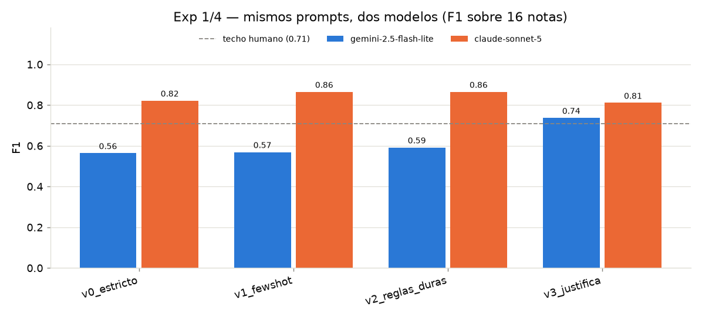
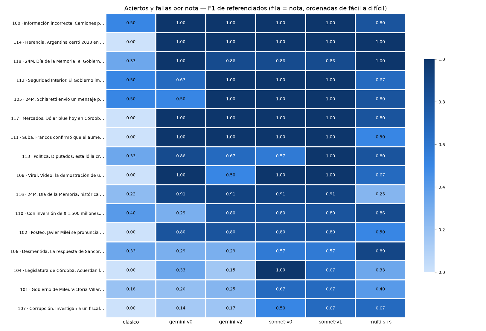

# Detección de fuentes periodísticas con LLMs

Bitácora de investigación del proyecto (seminario), sobre
**[trust-monitor](https://github.com/timmd-9216/trust)**.

**Problema:** detectar las *fuentes* de una noticia — a quién se le atribuye cada
información ("según el Banco Central…", "dijo el ministro…"). Queremos superar al
detector clásico basado en reglas usando modelos de lenguaje (LLMs), y documentar
el camino: experimentos, aciertos y fallas.

## Resultado actual

| Detector | Precisión | Recall | F1 |
|---|---|---|---|
| Clásico (reglas) | 0.26 | 0.25 | **0.26** |
| LLM `gemini-2.5-flash-lite` (mejor prompt: reglas duras) | 0.50 | 0.72 | **0.59** |
| LLM `claude-sonnet-5` (mejor prompt: few-shot) | 0.94 | 0.80 | **0.86** |
| Acuerdo entre anotadores (lch vs xig) | — | — | **0.71** |

Dos conclusiones centrales: (1) **el modelo importa más que el prompt** — con
prompts idénticos, Sonnet le saca +0.26–0.29 de F1 a Gemini, mientras la mejor
palanca de prompt mueve +0.03–0.06; (2) Sonnet queda **por encima del acuerdo
entre los dos anotadores humanos**, o sea que a partir de acá la medición está
limitada por el ruido del gold (16 notas), no por el modelo.

## Secciones
- [Bitácora de experimentos](experimentos.md) — **cada prompt/modelo probado, su número y su conclusión** (el corazón del proyecto).
- [Metodología](metodologia.md) — datasets y cómo evaluamos.
- [Esquema de salida](esquema_salida.md) — el formato v0 → v1 (compatible con Trust).
- [Roadmap y next steps](roadmap.md) — plan, experimentos y multi-LLM.

## Experimentos (resumen)
Detalle completo en la [bitácora](experimentos.md).

| # | Fecha | Experimento | F1 | Nota |
|---|---|---|---|---|
| 4 | 2026-08-07 | Citas implícitas (exploratorio, n=7) | — | LLM atrapa 5/7 vs clásico 2/7 |
| 3 | 2026-08-07 | Multi-LLM (2 pasadas) vs single-pass | 0.69 | **pierde** vs una pasada (0.73); el bug de truncamiento que casi arruina la comparación está documentado |
| 2 | 2026-08-07 | Salida rica v1 · span-F1 (sonnet) | 0.54 | supera al clásico (0.39) en los 3 componentes; [ejemplo de salida](https://github.com/mateoboerr/seminario_lunes/blob/main/results/ejemplo_v1.md) |
| 1 · S | 2026-08-07 | Misma grilla de prompts · claude-sonnet-5 | **0.86** | few-shot y reglas duras empatan; v0 solo ya da 0.82 |
| 1 · v2 | 2026-08-07 | LLM · reglas duras · gemini | 0.59 | la mejor variante en Gemini (+0.06 P) |
| 1 · v1 | 2026-07-02 | LLM · few-shot · gemini | 0.57 | +0.03 P, pero F1 casi igual |
| 0b | 2026-07-01 | v0 · prompt estricto · gemini-2.5-flash-lite | 0.56 | baseline LLM |
| 0a | 2026-07-01 | v0 · clásico (reglas) | 0.26 | baseline clásico |

_Quedan pendientes de cuota Gemini (free tier agotado; el cache retoma al
re-correr): `v3_justifica` de Gemini (8/16), v1-spans de Gemini (3/16) y la
config cross-model del multi-LLM. Ver [bitácora](experimentos.md)._
