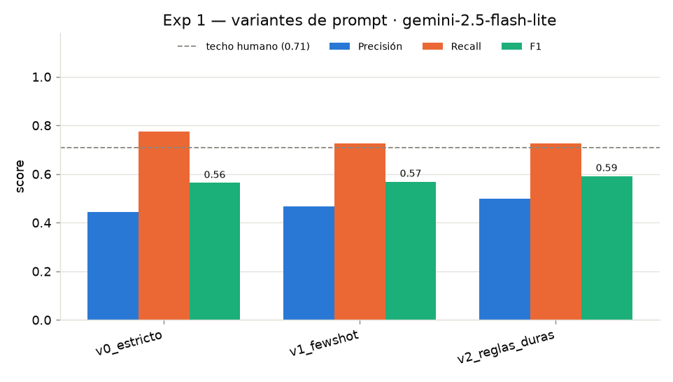
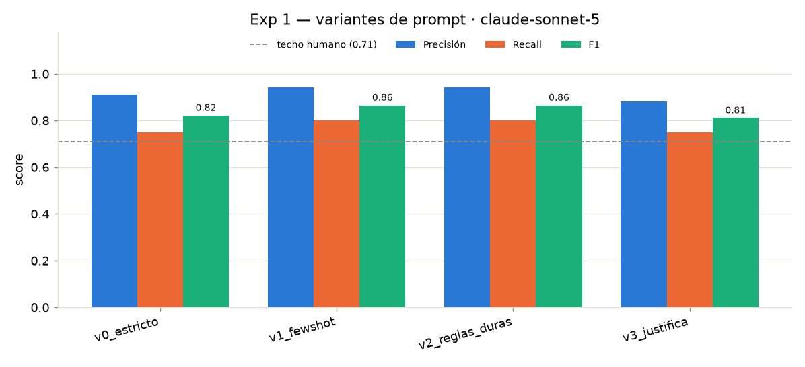

# Exp 1 — variantes de prompt (LLM) × modelos

- Artículos: **16** (lote doble-anotado) · techo humano **F1 0.71**
- Objetivo: subir la **precisión** sin perder recall; misma grilla de prompts en cada modelo (cache por modelo+variante — nunca mezclados).
- Las métricas se calculan **solo sobre notas con predicción**; la cobertura se reporta aparte. Solo celdas 16/16 son comparables.

## `gemini-2.5-flash-lite`

| Variante | Descripción | P | R | F1 | ΔP | ΔF1 |
|---|---|---|---|---|---|---|
| `v2_reglas_duras` | reglas negativas duras (ante la duda, excluir) | 0.50 | 0.72 | **0.59** | +0.06 | +0.03 |
| `v1_fewshot` | baseline + 2 ejemplos (few-shot) | 0.47 | 0.72 | **0.57** | +0.03 | +0.01 |
| `v0_estricto` | baseline v0 (prompt estricto) | 0.44 | 0.78 | **0.56** | +0.00 | +0.00 |

Celdas incompletas (sus métricas son sobre las notas cubiertas y NO son comparables con las corridas 16/16):

| Variante | Cobertura | P | R | F1 (parcial) |
|---|---|---|---|---|
| `v3_justifica` | 8/16 | 0.93 | 0.81 | 0.87 |

## `claude-sonnet-5`

| Variante | Descripción | P | R | F1 | ΔP | ΔF1 |
|---|---|---|---|---|---|---|
| `v1_fewshot` | baseline + 2 ejemplos (few-shot) | 0.94 | 0.80 | **0.86** | +0.03 | +0.04 |
| `v2_reglas_duras` | reglas negativas duras (ante la duda, excluir) | 0.94 | 0.80 | **0.86** | +0.03 | +0.04 |
| `v0_estricto` | baseline v0 (prompt estricto) | 0.91 | 0.75 | **0.82** | +0.00 | +0.00 |
| `v3_justifica` | auto-verificación: citar evidencia o descartar | 0.88 | 0.75 | **0.81** | -0.03 | -0.01 |

## Comparación de modelos (prompts idénticos)

| Variante | F1 `gemini-2.5-flash-lite` | F1 `claude-sonnet-5` | ΔF1 |
|---|---|---|---|
| `v0_estricto` | 0.56 | 0.82 | +0.26 |
| `v1_fewshot` | 0.57 | 0.86 | +0.30 |
| `v2_reglas_duras` | 0.59 | 0.86 | +0.27 |

